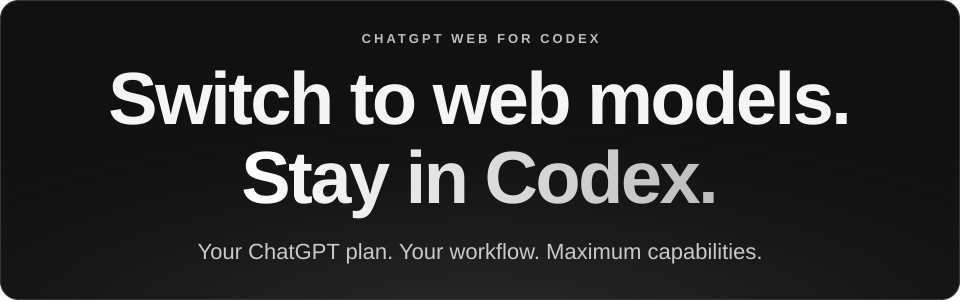
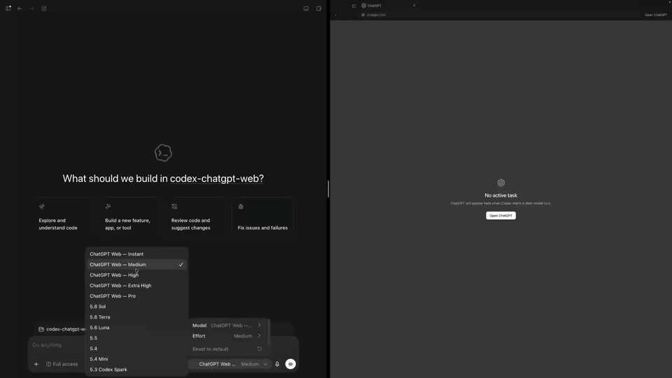

<p align="center">
  
</p>

<p align="center">
  <a href="https://github.com/miuuyy/codex-chatgpt-web/releases/download/v6.1.4/codex-web-gpt-6.1.4-win-x64.exe"></a>&nbsp;
  <a href="https://github.com/miuuyy/codex-chatgpt-web/releases/download/v6.1.4/codex-web-gpt-6.1.4-mac-arm64.dmg"></a>&nbsp;
  <a href="https://github.com/miuuyy/codex-chatgpt-web/releases/download/v6.1.4/codex-web-gpt-6.1.4-linux-x64.AppImage"></a>
</p>

<p align="center">
  <a href="https://github.com/miuuyy/codex-chatgpt-web/releases/download/v6.1.4/codex-web-gpt-6.1.4-mac-x64.dmg">macOS Intel</a> · <a href="https://github.com/miuuyy/codex-chatgpt-web/releases/latest">모든 릴리스</a>
</p>

<p align="center">
  <a href="README.md">English</a> · <a href="README.zh-CN.md">简体中文</a> · <a href="README.ja.md">日本語</a> · <a href="README.ko.md">한국어</a>
</p>

<p align="center">
  
</p>

<p align="center">
  <a href="#get-started">시작하기</a> · <a href="https://github.com/miuuyy/codex-chatgpt-web/releases">업데이트</a> · <a href="docs/architecture.md">아키텍처</a> · <a href="TROUBLESHOOTING.md">문제 해결</a>
</p>

Codex의 네이티브 모델 선택기에서 Pro를 포함해 계정에 제공되는 ChatGPT Web 모델을 사용하세요. ChatGPT Web의 별도 사용 한도를 사용하므로 Work나 Codex의 사용량은 차감되지 않습니다. 기존 인터페이스, 작업, 이미지, 스트리밍은 그대로 유지됩니다.

Full harness 모드는 MCP를 통해 ChatGPT를 현재 작업의 파일, 터미널, 도구 및 승인 절차에 연결합니다. 대화는 Codex 작업에 계속 연결되어 있으므로 컨텍스트가 늘어나도 작업을 이어갈 수 있습니다.

<div id="get-started"><a id="quick-start"></a></div>

## 시작하기

**사용 가능한 모델:** Free/Go → **Luna / Think**. 추론 설정이 있는 계정 → **Instant–High**, 계정에서 제공되는 경우 **Extra High** 및 **Pro**. 런처가 계정에서 사용할 수 있는 모델을 감지합니다.

1. **런처 설치**: 위에서 운영체제에 맞는 다운로드 버튼을 선택하세요.
2. **ChatGPT 로그인**: 내장 브라우저에서 로그인하고 브라우저 smoke test를 실행하세요.
3. **모델 설치**: Codex를 한 번 다시 시작한 뒤 **ChatGPT Web — …** 모델을 선택하세요.
4. **도구를 사용해 개발하려면**: 런처의 **MCP**를 열고 아래의 Full harness 설정을 완료하세요.

브라우저와 런타임이 앱에 포함되어 있습니다. Chrome, Node, Bun을 따로 설치할 필요가 없습니다.

<details>
<summary><strong>터미널 설치, 업데이트 및 복구</strong></summary>

업데이트 전에 런처를 종료하세요. 아래 설치 프로그램은 플랫폼과 아키텍처를 선택하고 공개된 체크섬을 검증하며 ChatGPT 프로필과 런처 설정을 보존합니다.

**macOS / Linux**

```bash
curl -fsSL https://github.com/miuuyy/codex-chatgpt-web/releases/latest/download/install-launcher.sh | sh
```

**Windows PowerShell**

```powershell
irm https://github.com/miuuyy/codex-chatgpt-web/releases/latest/download/install-launcher.ps1 | iex
```

</details>

<details>
<summary><strong>모델, 모드 및 MCP 설정</strong></summary>

<a id="modes"></a>

자동 모드는 추론 선택기가 없는 계정에 Luna/Think를 제공합니다. 그 외에는 Instant–High를 제공하고, Extra High와 Pro는 각각 계정에서 사용 가능한 경우에 표시됩니다.

| 모드 | 메시지 전송 | 로컬 Codex 도구 |
| --- | --- | --- |
| **Browser-only** | 자동 | 없음 |
| **Full harness (With Automation)** | 자동 | MCP를 통해 사용 |
| **Zero Risk** | 직접 붙여넣고 전송 | 별도 MCP 커넥터를 통해 사용 |

Zero Risk는 ChatGPT 페이지를 읽거나 조작하지 않습니다. 모델과 `Codex Zero Risk` 커넥터를 직접 선택하고, 준비된 프롬프트를 붙여넣어 전송한 다음 런처에서 **Sent**를 확인하세요. 이름이 **(Web)** 으로 끝나는 자동 모델은 Codex에서 지원하는 Effort를 선택할 수 있습니다. 각 컨텍스트 한도를 유지하기 위해 Instant와 각 Pro 버전은 별도 항목으로 제공됩니다. 기존 작업에 저장된 이전 모델 항목은 원래의 고정 모드를 유지합니다.

<a id="full-harness"></a>

### Full harness

Full 모드는 공식 [OpenAI tunnel-client](https://github.com/openai/tunnel-client)를 통해 ChatGPT의
도구 호출을 현재 Codex 작업으로 다시 연결합니다. 터널은 outbound 방식이므로 공인 IP를 노출하거나
inbound 포트를 열거나 라우터 포트 포워딩을 설정할 필요가 없습니다.

런처의 MCP 페이지가 전체 설정 과정을 안내합니다. 정확한 클릭 순서는 런처 안의 영상 가이드를
참고하세요.

> [!NOTE]
> **Limits**
>
> GPT-5.6 Sol Pro 및 GPT-6 Astra의 현재 ChatGPT 메시지 허용량은
> [Limits](https://github.com/miuuyy/codex-chatgpt-web/discussions/309)를 참고하세요.
> 컨텍스트 한도는 계정 유형과 선택한 effort에 따라 달라집니다. Plus의 Medium/High는 실측
> 90,000-token 창을 사용하며, 실험적 3× context를 활성화하면 최대 270,000 tokens까지 확장됩니다.
> 모든 경우에 네이티브 Codex compaction이 지원됩니다.

1. 필수 설정을 완료하고 **MCP**를 연 다음 Tunnel과 일반 API 키를 생성하고
   **하네스 연결**을 누릅니다.
2. ChatGPT **Developer Mode**를 활성화하고, **Tunnel** 방식의 새 커넥터를 만들고 이름을 정확히
   **Codex Native2**로 지정합니다. **Authentication: None**과 **Allow all actions**를 사용합니다.
3. **런타임 검증**을 실행해 **Codex Native2**가 연결되어 사용 가능한지 확인합니다.

쓰기/수정 작업은 ChatGPT 작업 공간과 관리자 정책에서도 허용되어야 합니다.
[Developer Mode와 MCP 앱](https://help.openai.com/en/articles/12584461-developer-mode-and-mcp-apps-in-chatgpt)을
참고하세요. `--auto-approve-tool-calls`를 명시적으로 활성화하지 않은 상태에서 예상치 못한 승인
프롬프트가 나타나면 fail-closed로 처리됩니다. 이 옵션은 **Allow once**만 클릭하며 영구 권한은
부여하지 않습니다.

</details>

<details>
<summary><strong>진단 및 서브에이전트</strong></summary>

<a id="operations"></a>

**활동**에서 안전한 로컬 진단을 확인하고 **설정 → 진단 실행**에서 end-to-end 상태 확인을
수행할 수 있습니다. 설정에서는 유지 중인 브라우저 턴을 취소하거나 제거 전에 Codex 통합을
삭제할 수도 있습니다. 모든 브라우저 checkpoint에서 스크린샷이 필요한 경우에만
`CODEX_CHATGPT_WEB_BROWSER_DIAGNOSTICS=1`을 설정하세요.

새 설치에서는 cross-backend subagent에 **Compatibility V1**을 사용합니다. **Native**는 Codex
자체 기능 설정을 유지하면서 plaintext Web-to-Web V2 delegation을 활성화합니다. 프로토콜을
변경한 뒤에는 Codex를 다시 시작하고 새 작업을 시작하세요.

```bash
codex-chatgpt-web subagents status
codex-chatgpt-web subagents compatibility-v1
codex-chatgpt-web subagents native
```

</details>

<details>
<summary><strong>시스템 요구 사항 및 보안</strong></summary>

<a id="limitations-and-security"></a>

- 이 프로젝트는 비공식 브라우저 자동화이며 OpenAI API가 아닙니다. ChatGPT UI 변경으로 selector가
  깨질 수 있으며, 이 경우 모델이나 전송 방식을 조용히 바꾸지 않고 명시적으로 실패합니다.
- 브라우저 상태는 민감한 로그인 정보이며 loopback listener는 동일한 로컬 사용자로 실행되는
  프로세스에서 접근할 수 있습니다. 런처 프로필을 공유하지 말고 신뢰할 수 있는 워크스테이션에서
  사용하세요.
- 현재 릴리스 패키지는 macOS 13+(arm64/x64), Windows x64 및 Linux x64를 대상으로 합니다.
  런타임, 테스트 및 패키징은 CI에서 세 운영체제 모두에 대해 검증되며, 계정 종속 브라우저 및
  MCP 흐름은 별도의 release validation을 사용합니다.
- 아직 플랫폼 서명이 적용되지 않은 빌드에서는 Gatekeeper 또는 SmartScreen 경고가 표시될 수
  있습니다. 설치 프로그램은 설치 전에 공개된 SHA-256 manifest를 확인합니다.

Full 모드를 활성화하기 전에 전체 [아키텍처](docs/architecture.md)와
[보안 모델](docs/security-model.md)을 읽어보세요. 취약점은 [SECURITY.md](SECURITY.md)를 통해
보고해 주세요.

Temporary Chat은 [ChatGPT의 개인정보 보호 모드](https://help.openai.com/en/articles/8914046-temporary-chat-faq)이며, 프롬프트는 여전히 OpenAI에서 처리됩니다.

검증 범위: [release validation](docs/release-validation.md).

이 프로젝트는 OpenAI와 제휴하거나 OpenAI의 보증을 받은 소프트웨어가 아닌 독립적인 소프트웨어입니다.
본인 소유의 계정으로만 사용하고 적용되는
[이용 약관](https://openai.com/policies/terms-of-use/)과 작업 공간 정책을 준수하세요.
이 프로젝트는 인증이나 접근 제어를 우회하지 않습니다.

</details>

<details>
<summary><strong>소스 실행 및 개발</strong></summary>

<a id="development"></a>

```bash
git clone https://github.com/miuuyy/codex-chatgpt-web.git && \
cd codex-chatgpt-web && \
bun run app
```

소스 실행에는 Bun 1.4.0이 필요합니다. 이 명령은 잠긴 의존성을 설치하고 앱을 엽니다.

```bash
bun run app
bun run dev:launcher
bun run src/cli.ts dev status
bun run dev:chat compaction-lab "Reply with exactly: DEV READY"
bun run verify
bun run smoke:subagents
bun run app:package
```

`dev:launcher`는 `~/.codex-chatgpt-web-dev`의 별도 프로필과 계정을 사용합니다. `dev:chat`은 실제 브라우저와 compaction 경로를 사용하며, 도구 결과는 명시적인 시뮬레이션입니다. 일반 Codex 경로는 변경하지 않습니다. 설정과 명령은 [DEV chat harness](docs/dev-chat.md)를 참고하세요.

</details>

## Star History

<a href="https://www.star-history.com/?repos=miuuyy%2Fcodex-chatgpt-web&type=date&legend=top-left">
  <picture>
    <source media="(prefers-color-scheme: dark)" srcset="https://api.star-history.com/chart?repos=miuuyy/codex-chatgpt-web&type=date&theme=dark&legend=top-left&sealed_token=hBVvg_eOjfMFDrfyeo5FPQkIwcvBEmXc6F7ZoOKnfFE4KPCs67o34w4XwVuM-bHGnKR-SKCAN_TSTWrzuqSBNU-RjNZCLT4f-xNs9qcDhciQtemxHKuuFj0N5YNqZIihdaQfakrh2ANhOrvP0K2LmLXX2zbsYyVaYZknyTnlYeIS_mOGvMcO32ZmPCHK">
    <source media="(prefers-color-scheme: light)" srcset="https://api.star-history.com/chart?repos=miuuyy/codex-chatgpt-web&type=date&legend=top-left&sealed_token=hBVvg_eOjfMFDrfyeo5FPQkIwcvBEmXc6F7ZoOKnfFE4KPCs67o34w4XwVuM-bHGnKR-SKCAN_TSTWrzuqSBNU-RjNZCLT4f-xNs9qcDhciQtemxHKuuFj0N5YNqZIihdaQfakrh2ANhOrvP0K2LmLXX2zbsYyVaYZknyTnlYeIS_mOGvMcO32ZmPCHK">
    
  </picture>
</a>

---

[문제 해결](TROUBLESHOOTING.md) · [보안](SECURITY.md) · [기여](CONTRIBUTING.md) · [MIT 라이선스](LICENSE) · [CI](https://github.com/miuuyy/codex-chatgpt-web/actions/workflows/ci.yml)

제가 만든 또 다른 앱:  [ChatGPT Persona Voice](https://github.com/miuuyy/ChatGPT-Persona-Voice) — ChatGPT와 Codex를 위한 로컬, 거의 실시간의 사용자 지정 음성.
